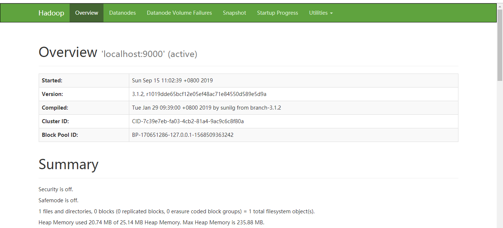

## Hadoop 伪集群运行官方例子

### 配置Hadoop

编辑文件`etc/hadoop/core-site.xml` ，修改后内容如下：

```xml
<configuration>
    <property>
        <name>fs.defaultFS</name>
        <value>hdfs://localhost:9000</value>
    </property>
</configuration>
```

编辑文件`etc/hadoop/hdfs-site.xml` ，修改后内容如下：

```xml
<configuration>
    <property>
        <name>dfs.replication</name>
        <value>1</value>
    </property>
</configuration>
```

### 配置SSH

```bash
$ ssh localhost
```

```bash
$ ssh-keygen -t rsa -P '' -f ~/.ssh/id_rsa
$ cat ~/.ssh/id_rsa.pub >> ~/.ssh/authorized_keys
$ chmod 0600 ~/.ssh/authorized_keys
```

### 启动

1. 格式化文件系统，只需要第一次启动时执行（每次执行会清空上次的数据）。

   ```bash
   $ bin/hdfs namenode -format
   ```

2. 启动dfs系统。

   ```bash
   $ sbin/start-dfs.sh
   ```

3. 查看效果。访问服务器9870端口，比如 [http://192.168.164.128:9870](http://192.168.164.128:9870/)

   如果外网一直访问不了，请检查是不是防火墙的原因。关闭防火墙命令：

   ```bash
   systemctl stop firewalld.service            #停止firewall
   systemctl disable firewalld.service        #禁止firewall开机启动
   ```

   效果如图：

   

4. 新建一个HDFS的文件夹，来进行MapReduce操作。

   ```bash
   $ bin/hdfs dfs -mkdir /user
   $ bin/hdfs dfs -mkdir /user/<username>
   ```

   


```bash
Starting secondary namenodes [localhost.localdomain]
ERROR: Attempting to operate on hdfs secondarynamenode as root
ERROR: but there is no HDFS_SECONDARYNAMENODE_USER defined. Aborting operation.
```

需要执行上面的SSH配置操作。

```bash
Starting secondary namenodes [localhost.localdomain]
localhost.localdomain: Permission denied (publickey,gssapi-keyex,gssapi-with-mic,password).
```

