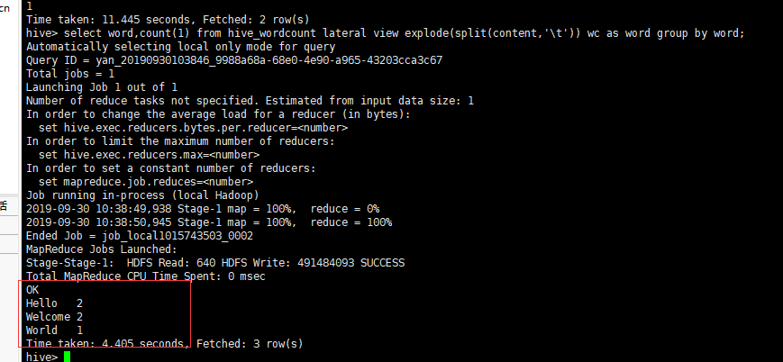

## Hive 的基本操作

### DDL Operations

DDL : Data Definition Language 

> 官网教程：https://cwiki.apache.org/confluence/display/Hive/GettingStarted#GettingStarted-DDLOperations

创建表格

```sql
CREATE TABLE pokes (foo INT, bar STRING);
```

查看所有表格

```sql
SHOW TABLES;
```

查看表格所有属性

```sql
DESCRIBE pokes;
```

重命名Table

```sql
ALTER TABLE pokes RENAME TO 3koobecaf;
```

添加属性

```sql
ALTER TABLE pokes ADD COLUMNS (new_col INT);
```

删除表格

```sql
DROP TABLE pokes;
```


### DML Operations

加载本地文件

```sql
LOAD DATA LOCAL INPATH './examples/files/kv1.txt' OVERWRITE INTO TABLE kv1;
```

如果这个步骤出现错误如下：

```bash
FAILED: SemanticException Line 1:23 Invalid path ''./examples/files/kv1.txt'': No files matching path file:/home/yan/examples/files/kv1.txt
```

说明加载文件失败，这个是由于配置了Hive环境变量，而加载文件使用了相对路径所引起的。

解决方法：跳转到Hive文件夹，然后输入 `bin/hive` 来启动Hive。


加载HDFS上面的文件与加载本地文件的区别在于

	1. 去掉 `LOCAL` 参数。
 	2. 使用HDFS 中的绝对路径。

### SQL

select 

```sql
select * from kv1;

select * from kv1 where content="90";
```

insert

```sql
insert into kv1 values("stupid");
```

### 例子：使用Hive进行词频统计

1. 添加本地txt文本，hello.txt，并且写入内容如下（其中每个单词用\t分隔）

   ```bash
   Hello	World	Welcome
   Hello	Welcome
   ```

2. 导入该txt文本数据到Hive中。

   在Hive控制台中输入命令如下，创建表。

   ```sql
   create table hive_wordcount(content string);
   ```

   导入数据到这个表中

   ```sql
   load data local './hello.txt' overwrite into table hive_wordcount;
   ```

3. 输入sql语句进行词频统计。

   ```sql
   select word,count(1) from hive_wordcount lateral view explode(split(content,'\t')) wc as word group by word;
   ```

4. 可以看到输出的效果如下：

   


### 常见问题

```bash
Ended Job = job_1545829388777_0070 with errors
Error during job, obtaining debugging information...
FAILED: Execution Error, return code 2 from org.apache.hadoop.hive.ql.exec.mr.MapRedTask
MapReduce Jobs Launched: 
Stage-Stage-1:  HDFS Read: 0 HDFS Write: 0 FAIL
Total MapReduce CPU Time Spent: 0 msec
```

失败原因
经查发现发现/tmp/hadoop/.log提示java.lang.OutOfMemoryError: Java heap space，原因是namenode内存空间不够，jvm不够新job启动导致。

解决方法
将你的hive可以设置成本地模式来执行任务试试：

```bash
set hive.exec.mode.local.auto=true;
```


> Smileyan
>
> 2019年9月30日	22:52