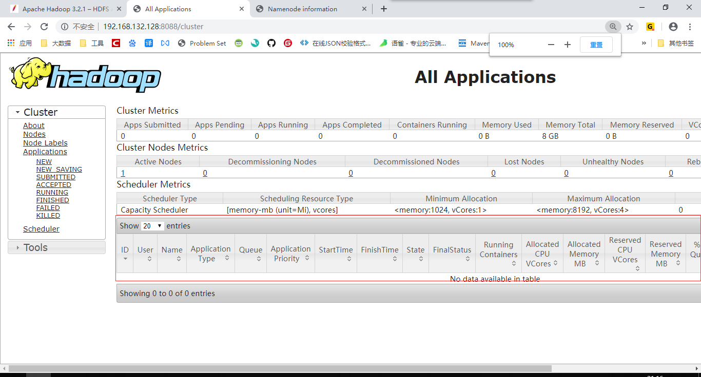

## YARN 入门

### YARN 简介

> The fundamental idea of YARN is to split up the functionalities of resource management and job scheduling/monitoring into separate daemons. The idea is to have a global ResourceManager (*RM*) and per-application ApplicationMaster (*AM*). An application is either a single job or a DAG of jobs.

YARN 即资源调度框架，用来提高资源利用率，减少运维成本。

### YARN 配置

1. tc/hadoop/mapred-site.xml：

   ```xml
   <configuration>
       <property>
           <name>mapreduce.framework.name</name>
           <value>yarn</value>
       </property>
   </configuration>
   ```

2. `etc/hadoop/yarn-site.xml`:

   ```xml
   <configuration>
       <property>
           <name>yarn.nodemanager.aux-services</name>
           <value>mapreduce_shuffle</value>
       </property>
   </configuration>
   ```

### YARN 的启动

```bash
$ sbin/start-yarn.sh/
```

然后打开浏览器访问其 `8080` 端口即可，当然，因为使用的是虚拟机，需要加上IP地址进行访问：`http://192.168.132.128:8088`

为了看到效果，可以在此基础上，再启动HDFS，就可以看到浏览器上会显示：




> Smileyan
>
> 2019年9月29日  21:21