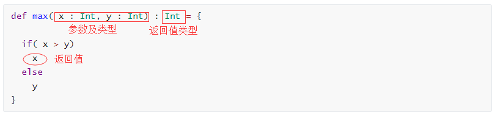

## scala 方法

### 方法的定义与使用



### 例子

```scala
def main(args: Array[String]): Unit = {
  println(add0(2,3))
  println(add1(5,4))
  hello()
  hello
}

def add0(x:Int,y:Int) = {
  x + y
}


def add1(x:Int,y:Int) = x+y


def add2(x:Int,y:Int) :Int = {
  x + y
}

def add3(x:Double,y:Double) : Double = {
  x + y
}

// 当返回值类型很明显的时候，可以省略
def add4(x:Double,y:Double) = {
  x + y
}

def hello() {
  println("Hello Hello")
}
```

返回值：如果有返回值，则最后一行则是返回值

### 默认参数的使用

默认参数：在方法定义时，允许指定方法中参数的默认值。

```scala
def main(args: Array[String]): Unit = {
  stupid()
  stupid("Xiaoming")
  stupid2("Xiaohua")
  stupid2("Xiaohua","Xiaoyan")
}

def stupid(name : String = "Me" ) = {
  println(name + " is stupid.")
}

def stupid2(name1:String, name2:String="Xiaoming") = {
  println(name2+" and "+name1 + " are both stupid .")
}
```

### 命名参数的使用

当参数不是特别多时，不建议使用。

可以理解为：往方法中传入参数的时候，传入值时附带变量名，从而可以不按照参数顺序排列。

```scala
def main(args: Array[String]): Unit = {
  hello("Num1","Num2")
  hello(name2 = "Num2",name1 = "Num1")
}

def hello(name1:String, name2:String) = {
  println("The first one is " + name1 + " and the second is " + name2)
}
```

### 可变参数的使用

相同类型的参数的数目可变，例子：

```scala
def main(args: Array[String]): Unit = {
  println(sum(1))
  println(sum(1,2))
  println(sum(1,2,3))
  println(sum(1,2,3,4))
}

// 注意*号
def sum(nums:Int*) = {
  var result = 0
  // 注意这个地方 <-
  for(num <- nums) {
    result += num
  }
  result
}
```

### 循环

```scala
def main(args: Array[String]): Unit = {
  aToB()
  visitArray()
  whileDemo()
}

// 从a到b
def aToB() = {
  for(i <- 1 to 10) {
    print(i+" ")
  }
  println()
  for(i <- 1 to 10 if i%2 == 0 ) {
    print(i+" ")
  }
  println()
  for(i <- 1 to 10 if i%2 == 0 && i>4 ) {
    print(i+" ")
  }
  println()
}

// 遍历数组
def visitArray() = {
  var courses = Array("Hadoop","Spark", "Hive", "Zookeeper", "HBase")
  courses.foreach(course => {
    print(course+" ")
  })
  println()
}

def whileDemo() = {
  var (num,sum) = (0,0)
  while(num<100) {
    sum += num
    // 不可以使用num++
    num = num + 1
  }
  println("1+2+...+99 == " + sum)
}
```


> Smileyan 
>
> 2019年10月3日 21:59